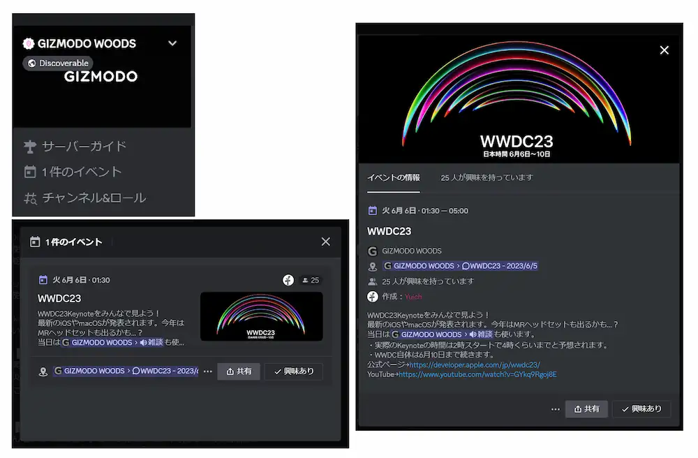

# イベントとは？

GIZMODO WOODSの参加者やモデレーターがイベントを設定することがあります。

興味のあるイベントを開くと詳細が確認でき、「興味あり（Interested）」を押すと、そのイベントの開始時間に通知を送ります。

## スレッドをフォロー

基本的にはイベントフォーラムのスレッドが開催場所として指定されているので、該当[スレッドをフォロー](/docs/tutorial-forum/forum-follow.md)してください。

こちらでは、イベント数日前よりイベント関連のチャットが盛り上がります。

:::note 例外

突発ライブなど、フォーラムのスレッドが作成されない場合があります。

ボイスチャットの「雑談」や「イベント」をご確認ください。

:::

## ライブビューイング

雑談ボイスチャンネルでもライブビューイングをしたりするかもしれません。

ボイスチャンネルでは読み上げbotも利用可能です。聞き専の方もぜひご参加ください！（[ボイスチャンネル内のチャットを開く方法](/docs/tutorial-voice-ch/voicechat-text.md)）

## イベントを共有する

GIZMODO WOODSのイベント共有リンクには、招待機能が含まれています。

:::danger 注意
共有する際は共有先のルールなどをご確認ください。

何か問題が生じた際の過失等は共有者のみにあり、ギズモード・ジャパン及びGIZMODO WOODSのモデレーターは一切責任を負いません。
:::
